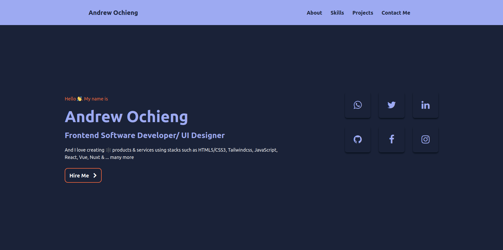

# Project Name 
    Personal Website

 

## Authors Name

    Andrew Ochieng

## Table of contents

- [General info](#general-info)
- [Technologies](#technologies)
- [Setup](#setup)
- [Contact Me](#contact)

## General info

This is my personal website that displays some of the skills I have in software development so far. The site also dsiplays a number of projects I have been able to work on in the past. Do connect with me through the social links provided.

## A view of the final product
 

 

## Technologies

    Project is created with:

        - HTML - Is used to build the structure of the pages.
        - Tailwindcss - Is used to style the pages
        - Google Fonts and Icons - Is used to impliment the icons and the fonts on the page
        - JavaScript - Functionality of the website includes e.g. Math methods & functions.

## Requirements

- Either a computer, Ipad, tablet or phone -An access to internet connection

## Program Setup

To run this project, clone or download it from git hub. Using Live server or your developers environment(Text Editor), start the server using Live server extention and automatically the website will work.

## Contact

    email: andrewomosh44@gmail.com

[LinkedIn](https://www.linkedin.com/in/andrew-ochieng-00b076180/) | 
[Twitter](https://twitter.com/drew_omosh) | 
[Github](https://github.com/Andrew-Ochieng)

## Live GitHub Pages Link

[Andrew's Personal Website](https://andrewomosh.netlify.app/)

## License information

[MIT](LICENCE)

Copyright (c) 2022 Andrew Ochieng
